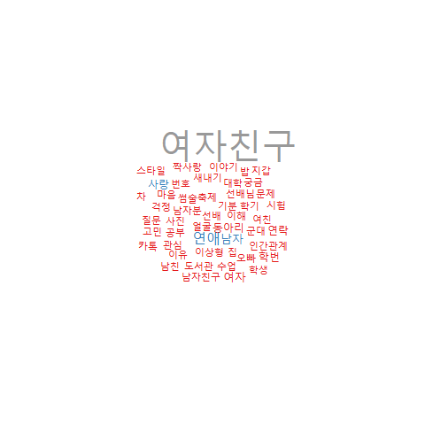

# Facebook-Textmining
In South Korea, there are Facebook web pages called "Bamboo Forest" where university students share their ideas anonymously. By scraping this pages, we are about to analyse what are the major issues around South Korean university students. 

<h2> Step1: Crawling Data </h2>
We parsed Facebook Page contents using Rfacebook Package.<br>
Scraped data from the date page was published until 2017-10-16.<br>
This code include only my part of scraping data. Rest of data (other universities) were scraped by other project members.
<a href="RfacebookCrawler.R"> RfacebookCrawler.R </a>

<h2> Step2: Cleansing Data </h2>
<ol>
<li> <b> Seperating Posts by documents. </b> <br>
          LSA method needs the each row of Document Term Matrix to be single document. However, there are some facebook page posts that includes 
          several documents. Therefore, we need to split those posts in to individual documents. <br>
          <a href="Post_seperation.md">Post-seperation.md </a> </li>
</ol>

## LSA

In this document, we will skip actuall running of the codes, 
1) it takes more than an hour for running
2) Knitting the rmd has encoding problems unresolved.
if you want to run the code, remove eval=FALSE.

1. Load Prepared Data


```r
load("FinalFBdata.RData")
```

2. Settings

```r
#Packages to use
packages = c("Rfacebook", "tm", "lsa", "wordcloud","ggplot2","KoNLP",
             "GPArotation","cluster","RWeka","ROAuth","fpc","stringr","ape","devtools")

for (i in packages){
  if(!require( i , character.only = TRUE))
  {install.packages(i, dependencies = TRUE)}
}


#Settings for NLP

pdf.options(family="Korea1deb") #not to tear down the letters
options(java.parameters=c("-Xmx4g","-Dfile.encoding=UTF-8")) #to increse heap size of rjava
options(mc.cores=1)
useNIADic()

#Wordcloud Color settting
pal <- brewer.pal(9,"Set1")
```

3. Extract Nouns

```r
# remove pucntuation: punctuation raise error
file1 <- unlist(file1)
file1 <- gsub("[[:punct:]]"," ",file1)

# remove redundant whitespace
file1 <- gsub("\\s+"," ", file1)


getNouns <- function(doc){
  doc <- as.character(doc)
  doc2 <- paste(SimplePos22(doc))
  doc3 <- str_match(doc2, "([가-??+)/NC")

  if( dim(doc3)[2] == 2){
    doc4 <- doc3[,2]
    doc4 <- doc4[!is.na(doc4)]
    return(doc4)
    }

}

nouns = sapply(file1,getNouns, USE.NAMES = F)

txt_noun1 <- nouns
```

4. Set the stop words
    * stop words are updated after several analyses

```r
words <- read.csv("2nd_stopwords.txt",header=FALSE)
words <- as.character(words$V1)
words <- c(words,c("싶","익명","갯짓","학과"))
words <- c(words, c("아대","있"))
```
    
5. Make a corpus

```r
# Vectorize the nouns 
corpus <- Corpus(VectorSource(txt_noun1))

# Removing numbers 
corpus <- tm_map(corpus, removeNumbers)

# Remove stopwords
corpus <- tm_map(corpus, removeWords, words)
```

6. Make a documentTermMatrix

```r
control = list(tokenize = uniTokenizer,
               removeNumbers = TRUE,
               wordLengths=c(2,20),
               removePunctuation = TRUE,
               stopwords = c("\\n","\n","것","c"),
               weighting = function (x) {weightTfIdf(x, TRUE)})

dtm <- DocumentTermMatrix(corpus, control=control)

# Encoding correction
Encoding(dtm$dimnames$Terms) ='UTF-8'
```

7. Remove Sparse Terms

```r
dt <- removeSparseTerms(dtm,0.994)
as.numeric(object.size(dt)/object.size(dtm)) * 100 # ratio of reduced/ original

# if dtm$i does not contain a particular row index p, then row p is empty.
check <- unique(dt$i)
dt <- dt[check,]
```

8. Make a LSA model

```r
LSA <-lsa(dt,dim=5)
st <-LSA$tk
wd <- LSA$dk
strength <- LSA$sk

# Varimax Rotation for better explaination
rot <- GPForth(wd, Tmat=diag(ncol(wd)), normalize=FALSE, eps=1e-5,
               maxit=10000, method="varimax",methodArgs=NULL)


cord <- st %*% diag(strength) %*% rot$Th
signs <- sign(colSums(rot$loadings))
cord <- cord %*% diag(signs)
text_lsa <- data.frame(cord=cord,file=file1[check])
```

9. Find an Elbow (Scree Plot)

```r
mysvd <- svd(dt)
ggplot(data = NULL, aes(x=seq_along(mysvd[["d"]]), y=mysvd[["d"]])) + 
  geom_line() + geom_point(colour="blue") + 
  xlab(label = "sqrt(EigenValue)")+ ylab("number of dimensions")+
  geom_vline(xintercept = 5, colour="red")+
  geom_vline(xintercept = 7, colour="red")
```


Appopriate dimension is around 5 ~ 7, through several analysis, we found that the fittest number of dimension was 5 in the point of plausable interpretation. 

9. Draw Word Clouds for each Dimension and Interpret!

```r
showmedim <- function(dimen){
  t<-rot$loadings[,dimen]
  tt<-abs(t)
  terms<-names(tt)
  wordcloud(terms,tt,scale=c(4,1),rot.per=0,max.words=50, colors = pal)
}

showmedim(1)
showmedim(2)
showmedim(3)
showmedim(4)
showmedim(5)
```





## LDA
now with the fact that we have 5 main topics on this corpus, we can apply LDA on this.


```r
#LDA
library(lda)
library(topicmodels)
ldaform <- dtm2ldaformat(td, omit_empty=TRUE)

result.lda <- lda.collapsed.gibbs.sampler(documents = ldaform$documents,
                                          K = 30, vocab = ldaform$vocab,
                                          num.iterations = 5000, burnin = 1000,
                                          alpha = 0.01, eta = 0.01)
#num.iterations posteria number of update
#burnin = burning of first value
#alpha = probability of topics in document / 1 = uniform
#eta = parameter setting = probability of words in one topic

attributes(result.lda)
dim(result.lda$topics)
result.lda$topics
top.topic.words(result.lda$topics)
result.lda$topic_sums #how many words 

#######################Visualization############################

theta <- t(apply(result.lda$topic_sums + alpha, 2, function(x) x/sum(x)))
phi <- t(apply(t(result.lda$topics) + eta, 2, function(x) x/sum(x)))

MovieReviews <- list(phi = phi,
                     theta = theta,
                     doc.length = 85432,
                     vocab = ldaform$vocab,
                     term.frequency = TermFreq)

options(encoding = 'UTF-8') #한글로 결과 보기

library(LDAvis)

# create the JSON object to feed the visualization:
json <- createJSON(phi = MovieReviews$phi, 
                   theta = MovieReviews$theta, 
                   doc.length = MovieReviews$doc.length, 
                   vocab = MovieReviews$vocab, 
                   term.frequency = MovieReviews$term.frequency, encoding='UTF-8')
#install.packages("servr")
library(servr)

serVis(json, out.dir = 'vis', open.browser = TRUE)
```

### [See LDA Visualization](https://rawgit.com/goodcheer/Facebook-Textmining/master/visual/index.html)

## Reports (Korean)

### [Download report.docx](reports/report.docx?raw=true)
